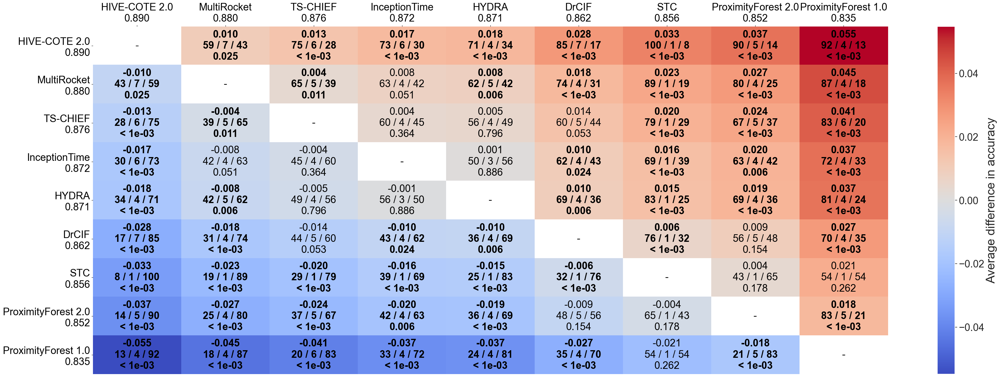
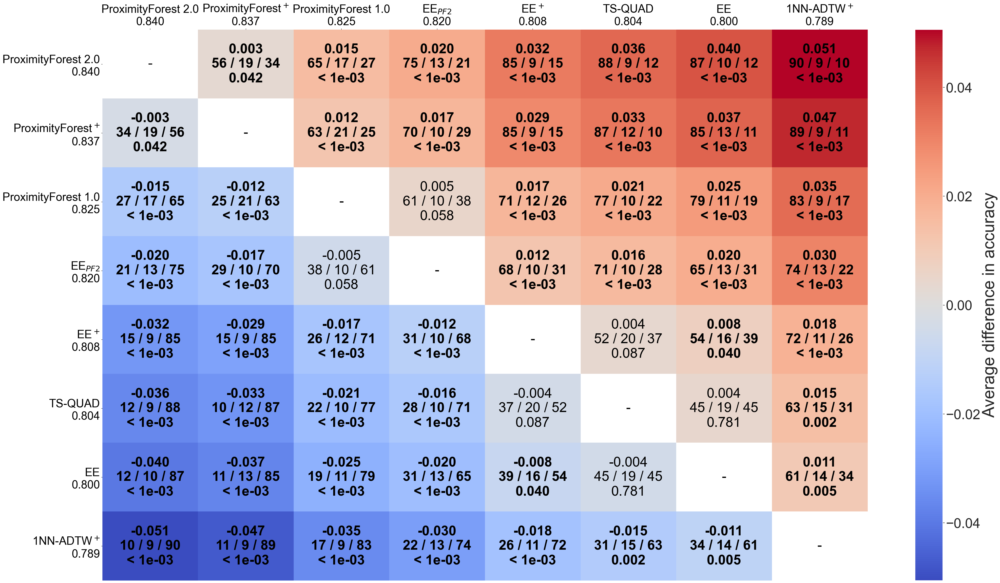

# ProximityForest 2.0
**Proximity Forest 2.0: A new effective and scalable similarity-based classifier for time series**

*Preprint*: []() 

> <div align="justify">Time series classification (TSC) is a challenging task due to the diversity of types of feature that may be relevant for different classification tasks, including trends, variance, frequency, magnitude, and various patterns. To address this challenge, several alternative classes of approach have been developed, including similarity-based, features and intervals, shapelets, dictionary, kernel, neural network, and hybrid approaches. While kernel, neural network, and hybrid approaches perform well overall, some specialized approaches are better suited for specific tasks. In this paper, we propose a new similarity-based classifier, Proximity Forest version 2.0 (PF 2.0), which outperforms  previous state-of-the-art similarity-based classifiers across the UCR benchmark and outperforms state-of-the-art kernel, neural network, and hybrid methods on specific datasets in the benchmark that are best addressed by similarity-base methods.  PF 2.0 incorporates three recent advances in time series similarity measures --- (1) computationally efficient early abandoning and pruning to speedup elastic similarity computations; (2) a new elastic similarity measure, Amerced Dynamic Time Warping (ADTW); and (3) cost function tuning. It rationalizes the set of similarity measures employed, reducing the eight base measures of the original PF to three and using the first derivative transform with all similarity measures, rather than a limited subset. We have implemented both PF 1.0 and PF 2.0 in a single C++ framework, making the PF framework more efficient.</div>

## Reference
If you use any part of this work, please cite:
```
@article{Herrmann2023PF2,
  title={{Proximity Forest 2.0}: A new effective and scalable similarity-based classifier for time series},
  author={Herrmann, Matthieu and Tan, Chang Wei and Salehi, Mahsa and Webb, Geoffrey I},
  year={2023},
  journal={arxiv:2023}
}
```

## Code
### Requirements
- C++ 20
- GCC 12
- MLPack: ```sudo apt-get install libmlpack```

### Building the program with cmake on linux systems

```
mkdir build
cd build
cmake -DCMAKE_BUILD_TYPE=Release ..
make
```

### Running the program
```
<EXEC_PATH> <path_to_csv_dataset> -t <nb_trees> -c <nb_candidates> -p <nb_threads> --pfc <pf_configs> -o <output_path>"

pf_configs: 
- pf2
- any combination of distances such as DA:DTWFull:DTW:WDTW:LCSS:MSM:ERP:TWE:ADTW in this format
``` 


## Results
1. [ProximityForest2_TESTFOLDS.csv](results/ProximityForest2_TESTFOLDS.csv) contains the accuracy for 30 resamples of 109 UCR datasets
2. [PF_time_fold0.csv](results/PF_time_fold0.csv) contains the train and test time for PF 1.0 and PF 2.0
3. [distance_based_fold0.csv](results/distance_based_fold0.csv) contains the accuracy for 109 UCR datasets on the default UCR splits
4. Distance selection: 5-fold cross validation accuracy on 53 'development' datasets
   1. [distance_selection_1dist.csv](results/distance_selection_1dist.csv)
   2. [distance_selection_2dist.csv](results/distance_selection_2dist.csv)
   3. [distance_selection_adtw.csv](results/distance_selection_adtw.csv)

<p align="center">
  
</p>

<p align="center">
  
</p>

**ProximityForest 2.0 as the most accurate similarity measure**
<p align="center">
  
</p>

## Acknowledgement
We would like to thank Professor Eamonn Keogh, Professor Tony Bagnall and their team who have provided the
[UCR time series classification archive](https://www.cs.ucr.edu/~eamonn/time_series_data_2018/) and
making a comprehensive benchmark [results](http://timeseriesclassification.com/results.php) widely available.